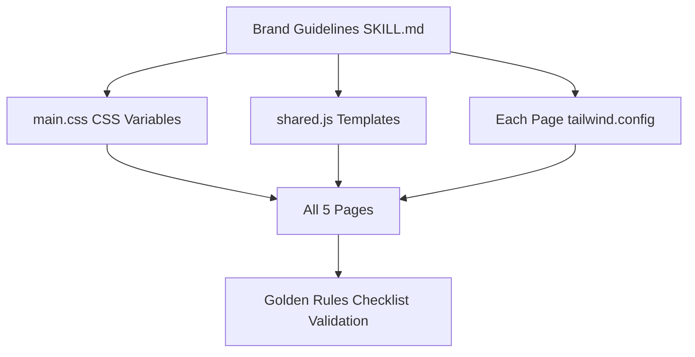

# TalBri Landing Page — Brand-Compliant Redesign Plan

## Gap Analysis: Current State vs. Brand Guidelines

| Area | Current State | Brand Requirement | Severity |
|------|--------------|-------------------|----------|
| **Font** | Inter (Google Fonts) | Outfit (Google Fonts) | 🔴 Critical |
| **Icons** | Feather Icons | Remix Icon (filled) | 🔴 Critical |
| **Letter spacing** | Not set | `-0.02em` on ALL text | 🔴 Critical |
| **Tailwind color tokens** | `primary`, `secondary`, `talbri-cyan`, `talbri-peach`, `talbri-orange`, `talbri-purple`, `talbri-bg` | `tb-dark`, `tb-dark-alt`, `tb-light-blue`, `tb-sky`, `tb-light-pink`, `tb-cream`, `tb-orange`, `tb-purple-dark`, `tb-purple-mid`, `tb-cyan` | 🔴 Critical |
| **CTA color** | Orange used on CTAs (mostly correct) but also `bg-primary` used on some CTAs | `#CE4614` orange **exclusively** for CTAs | 🟡 Medium |
| **Spacing** | Inconsistent — uses `py-16`, `py-20`, `px-4` | 8px grid: section `py-[120px]`, container `px-20`, heading-to-body `gap-4`, heading-to-CTA `mt-16` | 🟡 Medium |
| **Typography scale** | Ad-hoc sizes (`text-4xl`, `text-3xl`, `text-xl`) | H1: 56px/64px Bold, H2: 40px/48px SemiBold, H3: 32px/40px Medium, Body1: 24px/28px, Body2: 16px/20px | 🟡 Medium |
| **Container width** | `container mx-auto` (default Tailwind) | `max-w-[1440px] mx-auto` | 🟡 Medium |
| **Logo** | Used correctly with clearance | Already compliant | ✅ OK |
| **Figures** | Used as decorative ghosts on dark backgrounds (correct pattern) but inconsistent segment colors | Must match background segment; 4+ figures = uniform color | 🟡 Medium |
| **Section backgrounds** | `bg-talbri-peach` (pink) used heavily; `bg-talbri-bg` (cream) used; `bg-primary` (dark) used | Proven combos: dark→white text+ghost figures, blue→dark text+blue tonal, pink→dark text+pink tonal, white→dark text+segment figures | 🟡 Medium |
| **Navigation** | Custom built in shared.js with Inter, Feather Icons | Outfit, Remix Icons, `px-20 py-5 max-w-[1440px]` | 🔴 Critical |
| **Buttons** | Mixed — some `bg-primary`, some `bg-talbri-orange`, rounded corners, scale transforms | Orange only, `px-6 py-3 rounded`, `hover:bg-[#b33d11]`, no scale transforms | 🟡 Medium |
| **Dividers** | `w-20 h-1 bg-primary` used as section dividers | Not specified in brand guidelines — keep or remove based on visual hierarchy | 🟢 Low |

---

## Architecture Overview

The redesign touches **7 files** across 3 layers:

```
┌─────────────────────────────────────────────────┐
│                  SHARED LAYER                    │
│  styles/main.css    ← Rewrite CSS variables     │
│  scripts/shared.js  ← Rewrite header/footer/    │
│                        team/contact templates    │
└──────────────────────┬──────────────────────────┘
                       │
┌──────────────────────┴──────────────────────────┐
│                  PAGE LAYER                      │
│  index.html           ← Main landing page       │
│  nasa-misia/index.html                          │
│  pre-mladych/index.html                         │
│  pre-firmy/index.html                           │
│  pre-organizacie/index.html                     │
└─────────────────────────────────────────────────┘
```

### Data Flow



---

## Phase 1: Shared Infrastructure

### 1.1 `styles/main.css` — Complete Rewrite

**Changes:**
- Replace CSS custom properties with brand token names (`--tb-dark`, `--tb-orange`, etc.)
- Set `body { font-family: 'Outfit', sans-serif; letter-spacing: -0.02em; }`
- Remove Inter-related styles
- Update `.team-card`, `.section-heading`, `.content-box`, `.gradient-cta` to use brand tokens
- Add `.section-heading` to match H2 spec (40px, SemiBold, 48px line-height)
- Remove `.markdown-content` styles (unused)
- Add utility for the 8px grid spacing

### 1.2 `scripts/shared.js` — Template Rewrite

**Header changes:**
- Replace Feather Icons with Remix Icon classes (`ri-menu-line`, `ri-close-line`)
- Update nav to use `px-20 py-5 max-w-[1440px]` spacing
- Use Outfit-compatible font classes
- Update logo to use `h-8` (per brand nav spec)
- Active link styling with brand tokens

**Footer changes:**
- Replace Feather Icons with Remix Icons (`ri-mail-line`, `ri-linkedin-box-fill`)
- Use brand spacing tokens

**Team section changes:**
- Replace Feather Icons with Remix Icons (`ri-linkedin-box-fill`)
- Update to brand spacing

**Contact section changes:**
- Replace Feather Icons with Remix Icons (`ri-mail-line`, `ri-arrow-right-line`)
- Update to brand spacing

**Mobile menu:**
- Replace `feather.replace()` with Remix Icon initialization
- Update icon toggle logic for Remix Icons

### 1.3 Global Changes Across All Pages

Every page `<head>` must be updated:
- Replace `Inter` Google Fonts link with `Outfit` link:
  ```html
  <link href="https://fonts.googleapis.com/css2?family=Outfit:wght@300;400;500;600;700&display=swap" rel="stylesheet">
  ```
- Replace Feather Icons CDN scripts with Remix Icon CSS:
  ```html
  <link href="https://cdn.jsdelivr.net/npm/remixicon@4.0.0/fonts/remixicon.css" rel="stylesheet">
  ```
  (Remove both feather CDN script tags)
- Update `tailwind.config` color tokens:
  ```js
  tailwind.config = {
      theme: {
          extend: {
              colors: {
                  'tb-dark':        '#0C0E1B',
                  'tb-dark-alt':    '#1F212D',
                  'tb-light-blue':  '#ACDEEA',
                  'tb-sky':         '#C0E6EF',
                  'tb-light-pink':  '#FBE8E1',
                  'tb-cream':       '#FDF1ED',
                  'tb-orange':      '#CE4614',
                  'tb-purple-dark': '#522DCB',
                  'tb-purple-mid':  '#872DCB',
                  'tb-cyan':        '#268EC1',
              },
          },
      },
  };
  ```
- Update `<body>` class from `bg-white text-secondary` to `bg-white text-tb-dark font-['Outfit'] tracking-[-0.02em]`

---

## Phase 2: `index.html` — Main Landing Page Redesign

### Current Section Inventory & Redesign Map

| # | Current Section | Background | Redesign Action |
|---|----------------|------------|-----------------|
| 1 | Hero | `bg-talbri-peach` (pink) | Keep pink bg → `bg-tb-light-pink`. Add figure(s). H1: 56px Bold. Body1: 24px. CTA: orange only. |
| 2 | Problem Statement | `bg-talbri-bg` (cream) | Change to `bg-tb-light-blue` (blue) for variety. H2: 40px SemiBold. Cards with proper spacing. |
| 3 | Our Solution | `bg-white` | Keep white bg. Use segment-colored icons (cyan=talent, purple-mid=company, purple-dark=org). |
| 4 | Registration CTA | `bg-talbri-bg` (cream) | Change to `bg-tb-cream`. Orange CTA button only. |
| 5 | Process (Ako to funguje) | `bg-white` | Keep white bg. Timeline with proper typography. Replace Feather icons with Remix. |
| 6 | Final CTA | `bg-primary` (dark) | Keep dark bg → `bg-tb-dark`. Add ghost figures. Orange CTA. |

### Section-by-Section Spec

#### Hero Section
```
Background: bg-tb-light-pink (#FBE8E1)
Layout: max-w-[1440px] mx-auto px-20 py-[120px]
Figure: 1 figure (hero statement) — pink tonal, positioned right side
H1: text-[56px] leading-[64px] font-bold tracking-[-0.02em] text-tb-dark
Body: text-2xl leading-7 font-normal tracking-[-0.02em] text-tb-dark max-w-3xl
CTA gap from heading: mt-16
CTA buttons: bg-tb-orange text-white px-6 py-3 rounded font-semibold
Secondary link: text-tb-dark underline (no fill, no orange)
```

#### Problem Statement Section
```
Background: bg-tb-light-blue (#ACDEEA)
Layout: max-w-[1440px] mx-auto px-20 py-[120px]
H2: text-[40px] leading-[48px] font-semibold tracking-[-0.02em] text-tb-dark
Cards: bg-white, 2-column grid, gap-10
Card heading: H3 spec (32px/40px Medium)
Card body: Body2 spec (16px/20px)
Icons: Remix Icon, tb-dark color
```

#### Our Solution Section
```
Background: bg-white
Layout: max-w-[1440px] mx-auto px-20 py-[120px]
H2: text-[40px] leading-[48px] font-semibold tracking-[-0.02em] text-tb-dark
3 cards for segments:
  - Talent: icon in tb-cyan (#268EC1)
  - Company: icon in tb-purple-mid (#872DCB)
  - Organisation: icon in tb-purple-dark (#522DCB)
```

#### Registration CTA Section
```
Background: bg-tb-cream (#FDF1ED)
Layout: max-w-[1440px] mx-auto px-20 py-[120px]
H2: text-[40px] leading-[48px] font-semibold
Body: text-2xl leading-7
CTA: bg-tb-orange ONLY, px-6 py-3 rounded
```

#### Process Section (Ako to funguje)
```
Background: bg-white
Layout: max-w-[1440px] mx-auto px-20 py-[120px]
H2: text-[40px] leading-[48px] font-semibold
Timeline: vertical line on desktop, step badges with Remix Icons
Step cards: white bg, border-tb-light-pink/30
Typography: H3 for step titles, Body2 for descriptions
CTA within steps: tb-orange for action links
```

#### Final CTA Section
```
Background: bg-tb-dark (#0C0E1B)
Layout: max-w-[1440px] mx-auto px-20 py-[120px]
Ghost figures: 2-3 Postava SVGs at low opacity (10-15%), positioned decoratively
H2: text-[40px] leading-[48px] font-semibold text-white
Body: text-2xl leading-7 text-white
Primary CTA: bg-tb-orange text-white
Secondary CTA: border-2 border-white text-white (ghost button)
```

---

## Phase 3: `nasa-misia/index.html` Redesign

### Section Map

| # | Section | Redesign |
|---|---------|----------|
| 1 | Hero | `bg-tb-light-pink` → keep. H1: 56px Bold. |
| 2 | Hero Quote | White card. Body1 typography. |
| 3 | Problem Statement | Keep structure. Update typography, icons to Remix. |
| 4 | Our Solution | Keep. Update typography. |
| 5 | What is TalBri | Keep. Update typography, icons. |
| 6 | Value Creation (4 cards) | Keep 4-card grid. Segment colors on icons. |
| 7 | What Makes Us Different | Keep. Replace Feather with Remix. |
| 8 | How We Work | Keep. Update typography. |
| 9 | Where We Are (Timeline) | Keep. Update typography. |
| 10 | Why Join (3 cards) | Keep. Update typography. |
| 11 | Final CTA | Dark bg + ghost figures. Orange CTA. |

---

## Phase 4: `pre-mladych/index.html` Redesign

### Section Map

| # | Section | Redesign |
|---|---------|----------|
| 1 | Hero | `bg-tb-light-pink`. H1: 56px Bold. |
| 2 | Hero Quote | White card. |
| 3 | What Is Common | 3 cards + dark quote block. |
| 4 | Our Role | Icon list. Replace Feather → Remix. |
| 5 | What to Expect | Numbered steps. Update typography. |
| 6 | What You Get | Keep. Update typography. |
| 7 | What We Guarantee | Grid of guarantees. Replace icons. |
| 8 | Our Promise | Keep. Update typography. |
| 9 | References | Keep reference cards with images. |
| 10 | Final CTA | Dark bg + ghost Postava figures. Orange CTA. |

**Segment color for talent page:** Use `tb-cyan` (#268EC1) as accent throughout.

---

## Phase 5: `pre-firmy/index.html` Redesign

### Section Map

| # | Section | Redesign |
|---|---------|----------|
| 1 | Hero | `bg-tb-light-pink`. H1: 56px Bold. |
| 2 | Hero Quote | White card. |
| 3 | What Is Common | 3 cards + dark quote block. |
| 4 | Our Role | Icon list. Replace Feather → Remix. |
| 5 | What You Get | Keep. Update typography. |
| 6 | Why TalBri | Keep. Replace icons. |
| 7 | What We Need | Keep. Replace icons. |
| 8 | Final CTA | Dark bg + ghost Postava figures. Orange CTA. |

**Segment color for company page:** Use `tb-purple-mid` (#872DCB) as accent throughout.

---

## Phase 6: `pre-organizacie/index.html` Redesign

### Section Map

| # | Section | Redesign |
|---|---------|----------|
| 1 | Hero | `bg-tb-light-pink`. H1: 56px Bold. |
| 2 | Hero Quote | White card. |
| 3 | What Is Common | 3 cards + dark quote block. |
| 4 | Our Role | Icon list. Replace Feather → Remix. |
| 5 | What You Get | Keep. Update typography. |
| 6 | Why We Invite | Keep. Replace icons. |
| 7 | Your Role | 2-column grid. Replace icons. |
| 8 | Benefits | Icon list. Replace icons. |
| 9 | Shared Responsibility | Icon list. Replace icons. |
| 10 | Timeline | Keep. Update typography. |
| 11 | Final CTA | Dark bg + ghost Postava figures. Orange CTA. |

**Segment color for organisation page:** Use `tb-purple-dark` (#522DCB) as accent throughout.

---

## Phase 7: Golden Rules Checklist (Final Validation)

Every page must pass:

- [ ] Only Outfit font used (no Inter fallback)
- [ ] Letter spacing `-0.02em` on all text elements
- [ ] All spacing in multiples of 8px (or 4px)
- [ ] Orange (`#CE4614`) used **only** on CTAs
- [ ] Logo has protective clearance (`p-[1em]` wrapper)
- [ ] Figures match their background segment color
- [ ] 4+ figures = single uniform color
- [ ] No shadows, gradients, or outlines on the logo
- [ ] Sufficient air around figures — they don't crowd text
- [ ] Hierarchy is immediately clear at first glance
- [ ] Only Remix Icon (filled) used for iconography
- [ ] Tailwind color tokens match brand spec exactly
- [ ] Container width is `max-w-[1440px]`
- [ ] Section vertical padding is `py-[120px]`
- [ ] Typography scale matches: H1(56/64 Bold), H2(40/48 SemiBold), H3(32/40 Medium), Body1(24/28), Body2(16/20)

---

## Figure (Postava) Usage Plan

Available SVGs: Postava_1 through Postava_13

| Page | Figures | Placement | Color Rule |
|------|---------|-----------|------------|
| index.html Hero | 1 figure (Postava_1) | Right side, pink tonal | Matches `tb-light-pink` bg |
| index.html Final CTA | 2 figures (Postava_2, Postava_3) | Ghost overlay on dark | Dark tonal (`#1F212D`/`#252736`) |
| nasa-misia Final CTA | 2 figures (Postava_7, Postava_8) | Ghost overlay on dark | Dark tonal |
| pre-mladych Final CTA | 2 figures (Postava_11, Postava_12) | Ghost overlay on dark | Dark tonal |
| pre-firmy Final CTA | 2 figures (Postava_4, Postava_5) | Ghost overlay on dark | Dark tonal |
| pre-organizacie Final CTA | 2 figures (Postava_8, Postava_9) | Ghost overlay on dark | Dark tonal |

---

## Icon Mapping: Feather → Remix

| Feather Icon | Remix Icon | Usage |
|-------------|------------|-------|
| `alert-triangle` | `ri-alert-line` | Problem cards |
| `layers` | `ri-stack-line` | Problem cards |
| `users` | `ri-team-line` | Talent segment |
| `briefcase` | `ri-briefcase-line` | Company segment |
| `heart` | `ri-heart-line` | Organisation segment |
| `edit-3` | `ri-edit-line` | Registration step |
| `check-circle` | `ri-checkbox-circle-line` | Steps, guarantees |
| `activity` | `ri-pulse-line` | Testing |
| `award` | `ri-award-line` | Community step |
| `link` | `ri-link` | Matching step |
| `message-circle` | `ri-message-2-line` | Feedback step |
| `star` | `ri-star-line` | Growth |
| `search` | `ri-search-line` | Interview |
| `bar-chart-2` | `ri-bar-chart-line` | Data |
| `clock` | `ri-time-line` | Time indicators |
| `arrow-right` | `ri-arrow-right-line` | Action links |
| `target` | `ri-focus-2-line` | Goals |
| `trending-up` | `ri-trending-up-line` | Growth |
| `mail` | `ri-mail-line` | Contact |
| `linkedin` | `ri-linkedin-box-fill` | Social |
| `menu` | `ri-menu-line` | Mobile nav |
| `x` | `ri-close-line` | Mobile nav close |
| `map` | `ri-map-pin-line` | Mapping |
| `book-open` | `ri-book-open-line` | Learning |
| `shield` | `ri-shield-line` | Fairness |
| `eye` | `ri-eye-line` | Visibility |
| `sliders` | `ri-equalizer-line` | Assessment |
| `message-square` | `ri-message-2-line` | Feedback |
| `file-text` | `ri-file-text-line` | Documents |
| `zap` | `ri-flashlight-line` | Energy |
| `globe` | `ri-global-line` | Public sector |
| `alert-circle` | `ri-alert-line` | Warnings |
| `share-2` | `ri-share-line` | Sharing |
| `gift` | `ri-gift-line` | Benefits |
| `user` | `ri-user-line` | Person |